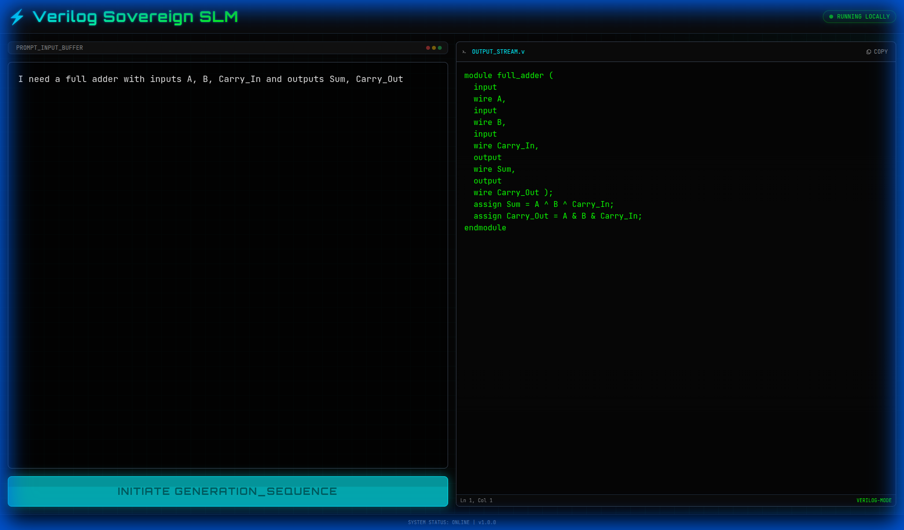

# ⚡ Sovereign AI Verilog Generator

A locally-running AI-powered Verilog code generator with a Cyberpunk-themed interface. Built for the **KrackHack Hackathon**.

> **100% Sovereign** — No cloud APIs. No data leaves your machine. Runs entirely on your local hardware.



---

## 🚀 Features

- 🧠 **Local LLM Inference** — Uses the `smolify/smolified-krackhack26verilog` model (270M params, Gemma3-based)
- ⚡ **Cyberpunk UI** — Dark theme with neon accents, terminal-style code output, JetBrains Mono font
- 📋 **One-Click Copy** — Copy generated Verilog to clipboard instantly
- 🔒 **Privacy First** — All processing happens locally on your machine
- 🎨 **Auto-Formatter** — Outputs properly indented, multi-line Verilog code

---

## 📦 Tech Stack

| Component | Technology |
|-----------|-----------|
| **Frontend** | HTML5, Tailwind CSS (CDN), Vanilla JS |
| **Backend** | Python, Flask, Flask-CORS |
| **AI Model** | HuggingFace Transformers, PyTorch |
| **Model** | `smolify/smolified-krackhack26verilog` (270M) |

---

## 🛠️ Setup & Installation

### Prerequisites
- Python 3.8+
- pip

### 1. Clone the Repository
```bash
git clone https://github.com/YOUR_USERNAME/sovereign-verilog-generator.git
cd sovereign-verilog-generator
```

### 2. Install Dependencies
```bash
pip install -r requirements.txt
```

### 3. Start the Server
```bash
python3 server.py
```
> ⚡ The model will download automatically on first run (~540MB).  
> The server starts at `http://localhost:5000`.

### 4. Open the Frontend
Open `index.html` in your browser — or simply:
```bash
xdg-open index.html   # Linux
open index.html        # macOS
```

---

## 💡 Usage

1. Type a circuit description in the **Prompt Buffer** (left panel)
   - Example: *"I need a full adder with inputs A, B, Carry_In and outputs Sum, Carry_Out"*
2. Click **INITIATE GENERATION_SEQUENCE**
3. Wait ~15-30s for the model to generate code
4. The formatted Verilog appears in the **Output Stream** (right panel)
5. Click **COPY** to copy the code to your clipboard

---

## 📁 Project Structure

```
├── index.html          # Frontend (single-file, Cyberpunk UI)
├── server.py           # Flask backend with model inference
├── requirements.txt    # Python dependencies
├── start.sh            # Quick-start script
└── README.md           # This file
```

---

## ⚙️ Configuration

Edit `server.py` to adjust:
- `DEVICE` — Change to `"cuda"` if your GPU supports it (may require debugging)
- `max_new_tokens` — Controls output length (default: 512)
- `temperature` — Controls randomness (default: 0.7)

---

## 🏗️ Architecture

```
┌─────────────┐     POST /generate      ┌──────────────┐
│  index.html │ ──────────────────────▶  │  server.py   │
│  (Browser)  │                          │  (Flask)     │
│             │ ◀──────────────────────  │              │
│  Tailwind   │     JSON { code: ... }   │  Transformers│
│  + Vanilla  │                          │  + PyTorch   │
│    JS       │                          │              │
└─────────────┘                          └──────────────┘
                                              │
                                              ▼
                                    ┌──────────────────┐
                                    │  smolified-      │
                                    │  krackhack26     │
                                    │  verilog (270M)  │
                                    └──────────────────┘
```

---

## 📄 License

This project uses the [smolify/smolified-krackhack26verilog](https://huggingface.co/smolify/smolified-krackhack26verilog) model. Please refer to the model card for licensing details.

---

## 🙏 Acknowledgments

- **Smolify AI** — For the smolified Verilog model
- **KrackHack Hackathon** — For the inspiration
- **HuggingFace** — For the Transformers library
